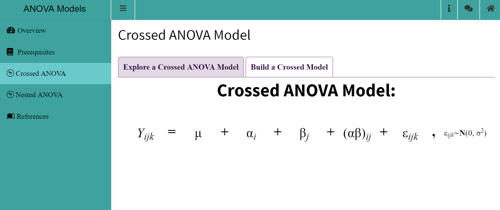

# ANOVA Models

 

# App Description
When designing ANOVA models, a crossed design is used when every possible combination of the levels of different factors are applied to experimental units. A nested design is used when each level of one factor can only be combined with one level of another factor. This app demonstrates the differences between creating model designs for crossed and nested ANOVAs.
